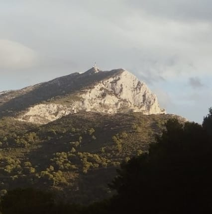

<link rel="stylesheet" href="styles.css">

## **Piyush Mishra**
**Ph.D. Student** 
piyush.mishra@univ-amu.fr
[Skills based CV](https://piyushmishra12.github.io/resume/Piyush%20Mishra%20CV.pdf)

## **Experience**
**Maths Inst. of Marseille & Fresnel Inst. (CNRS) | 10.2023 - Present** 
***Doctoral Fellow (Bioimage Mining Group, Turing Centre for Living Systems)*** 
Research algorithms for analysing microscopy images of cells in tissue-like environments by overcoming challenges associated with understanding complex molecular processes in these dynamic systems through combining algorithm design with experimental improvements to reduce reliance on *a priori* knowledge of particle movement.

**Maths Inst. of Marseille | 02.2023 - 07.2023** 
***Research Intern (M.S. Capstone)*** 
Developed ideas to leverage the power of transformers to model the complex patterns and dependencies in fluorescence microscopy data.

**State Univ. of New York (Stony Brook) | 04.2022 - 08.2022** 
***Research Intern*** 
Developed a transformer-based model for automated analysis of genomic sequences which could learn the grammar and patterns of DNA to uncover functional elements and potential applications.

**Quantiphi Inc. | 01.2021 - 08.2021** 
***Framework Eng. Intern (B.Tech. Capstone)*** 
Worked in the domain of software development (full-stack development) helping in generating ML/AI solutions for internal clients.

**Indian Inst. of Technology, Patna | 10.2019 - 12.2019** 
***Research Intern*** 
Developed new computational techniques for gene-clustering using incomplete-multi-omics approaches resulting in a latent space rich in genomic information.

**Calcutta Univ. | 01.2019 - 07.2019** 
***Research Intern*** 
Comparative study for human activity recognition using deep neural network approaches to simplify the previously used redundant techniques.

**Larsen & Toubro Ltd. | 12.2018 - 01.2019** 
***Intern at Data Centre*** 
Developed a prototype based on self-organising maps for outlier detection and assisted in handling data by writing simple queries.

## **Notable Publications**
**Mishra, P.** and Roudot, P., (2024). Comparative study of transformer robustness for multiple particle tracking without clutter. In EUSIPCO.

Dutta P., **Mishra P.**, Saha S. (2020). Incomplete multi-view gene clustering with data regeneration using Shape Boltzmann Machine. Computers in Biology and Medicine, Elsevier.

**Mishra P.**, Sahoo D., Khandelwal H., Amman N., Sobhanayak S. (2020). Minimised Jaya Algorithm-based Structure optimisation for Heterogeneous Wireless Sensor Networks. In ICCCS.

[Further details](https://piyushmishra12.github.io/publications/)

## **Education**
**Aix-Marseille Univ. | Marseille, France | 2023 - Present** 
Doctor of Philosophy, Maths (French Doctorate School of Maths, CS and Automatics, 184)

**Aix-Marseille Univ. | Marseille, France | 2021 - 2023** 
M.S., Computational and Mathematical Biology (Turing Centre for Living Systems) 
18.13/20

**International Inst. of Information Technology | Bhubaneswar, India | 2017 - 2021** 
B.Tech., Computer Science & Engineering  
8.51/10

## **Other Skills**
**Languages** 
* Odia (spoken: fluent, written: beginner) 
* Hindi (fluent) 
* English (fluent) 
* French (fluent) 

**Music** 
* Tabla player (Delhi school)
* Hindustani classical singer (Gwalior school)
